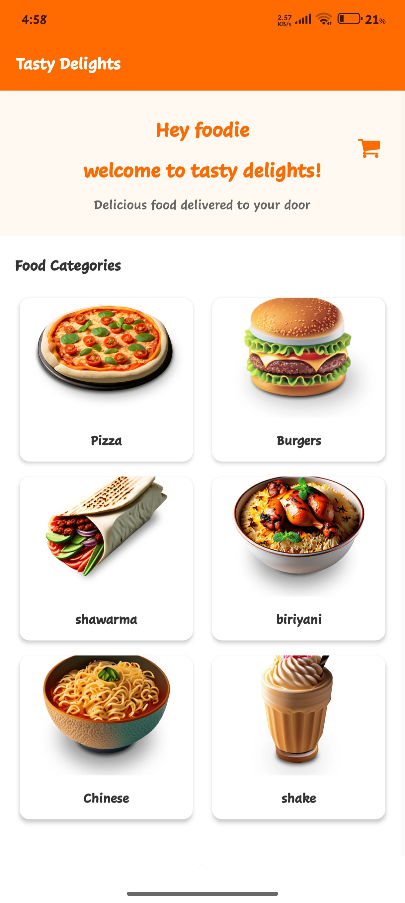
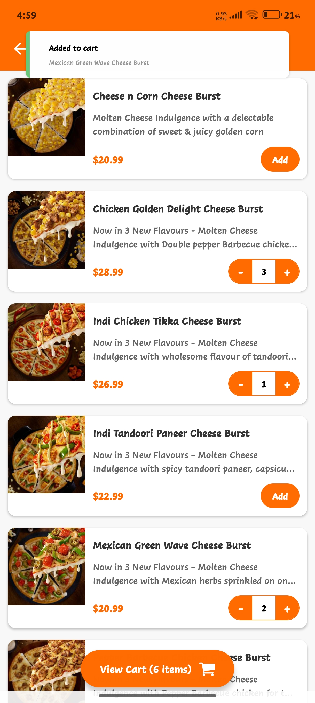
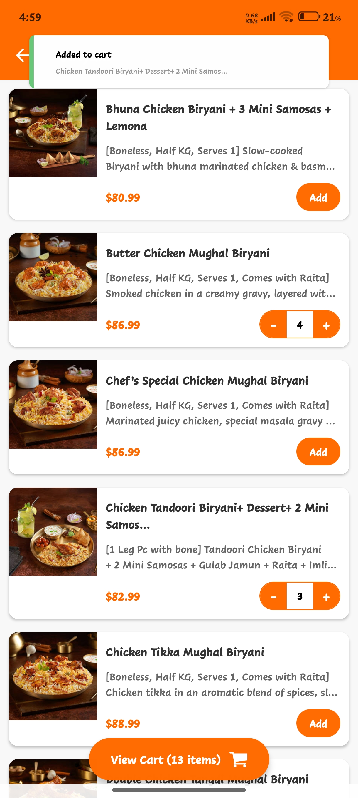
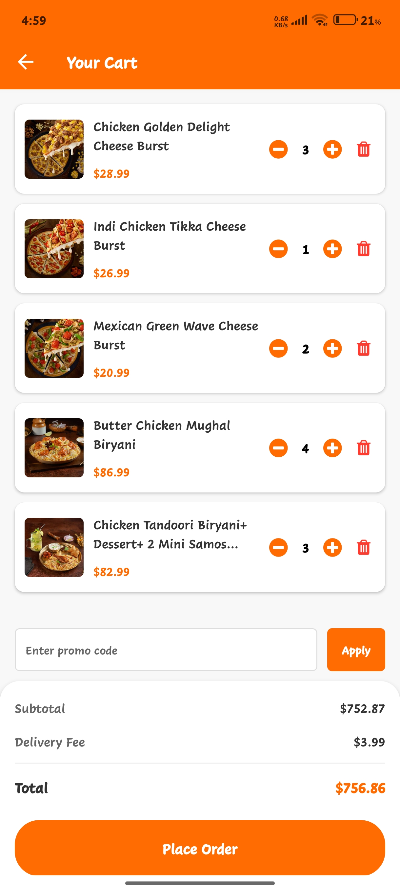
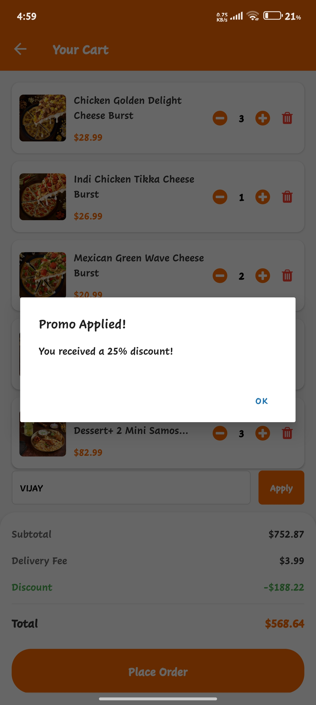
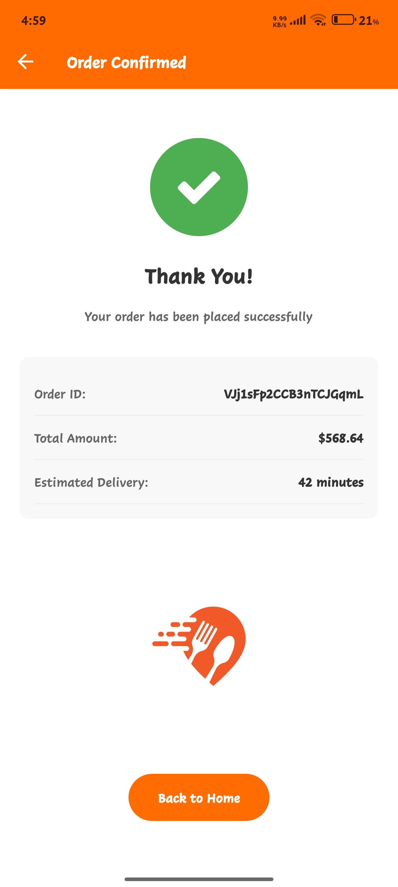

# 🍽️ Mini Food Ordering App

A simple and complete real-world food ordering mobile app built using React Native and Firebase.

## 🚀 Tech Stack

- **Frontend:** React Native (via Expo)
- **Backend & Database:** Firebase (Firestore)

## ✨ Key Features

- 🛒 Add to Cart with item count badge
- 📦 Order History stored in Firebase
- 🍔 View Menu Items by Category
- 💸 Use Coupon Code `VIJAY` to get 25% off
- ⚙️ Easily add/edit menu or categories via Firebase

## 📲 Screenshots









## 🛠️ Setup Instructions

1. Clone the repo:
   ```bash
   git clone https://github.com/mvijaykumar2820/miniFoodOrderingApp.git
   cd miniFoodOrderingApp
2. Install dependencies:
   ```bash
   npm install
3. Start the app (Expo):
   ```bash
   npx expo start
4. Scan the QR code with Expo Go app on your mobile.

🔐 Firebase
	•	Firebase handles real-time menu display and order history.
	•	You can add new items or categories directly in Firebase.

🙋‍♂️ Author
	•	Moodavath Vijay Kumar
	•	GitHub
	•	Email: mvijaykumar2820@gmail.com
